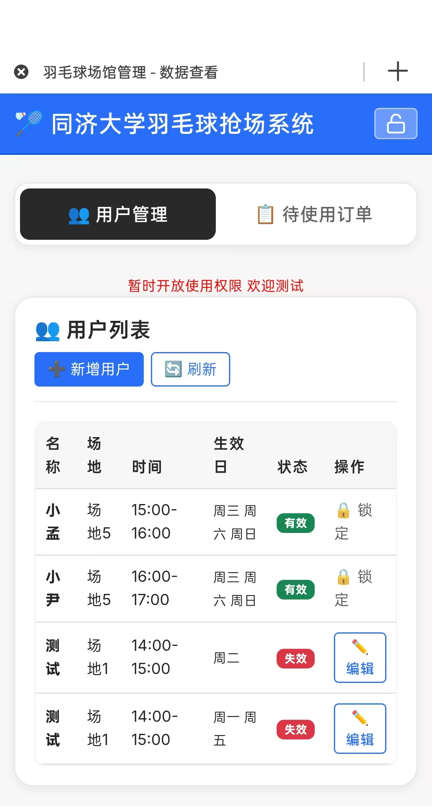
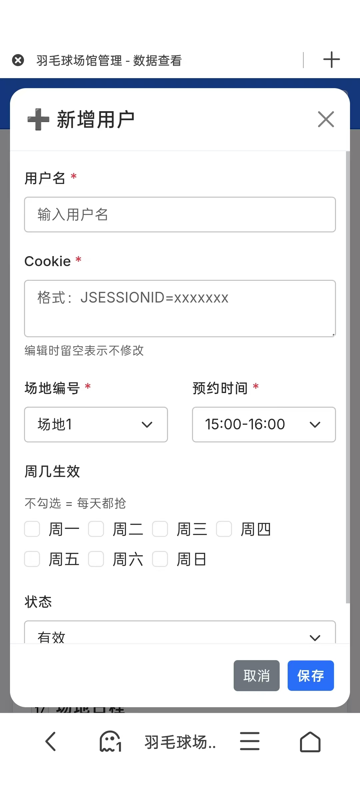
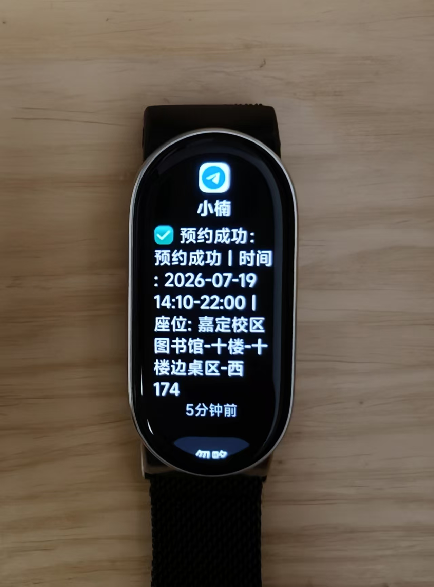
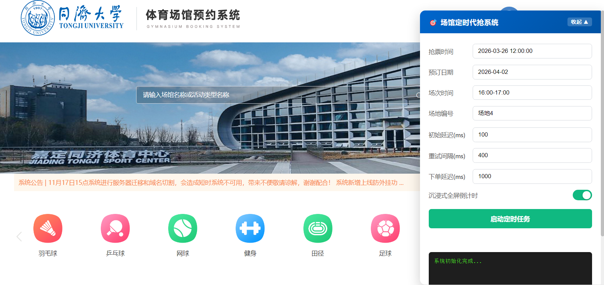
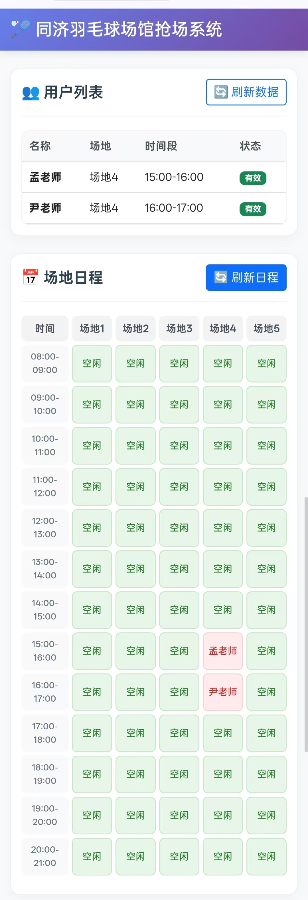
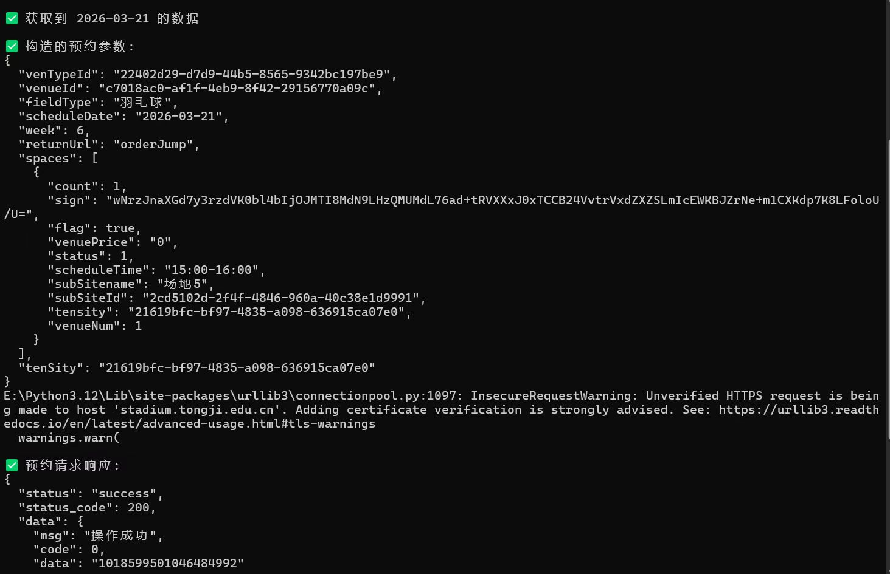
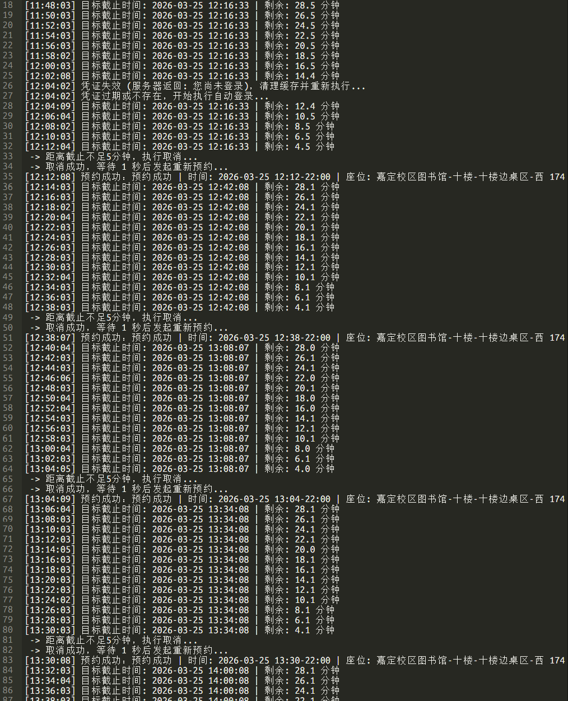
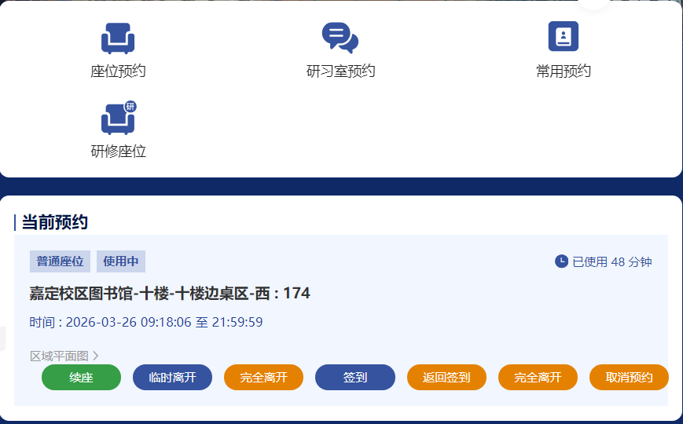

# tongji

最近写了不少好东西，不拿出来炫耀一下难受

更[new]：

抢羽毛球场地，改成自助上车了。每隔30min自动扫描添加到自动化脚本中。cookie需要从 https://stadium.tongji.edu.cn/ 这里自己抓，默认有保活机制，服务器不宕机会 ~~一直有效。~~

加了 TG 消息推送，不错不错

有个想法，直接在 vps 上用 claude cli 打通 TG bot，有想法直接手机给它发消息，改代码部署到公网岂不妙哉。

感觉能直接搓一套开源工作流。不比其他什么"大厂出品"安全简洁多了。

不想弄，还是太懒惰。懒惰是我一生的敌人。

---
[old]

1.羽毛球场馆代抢插件
逆向了整个加密流程，直接对接了下单的api [叉腰]
牛不牛! 

---
还有更牛的 

2.部署到了服务器上，每天定时触发，24小时全自动

---
3.图书馆占座

全自动占位，签到时间不足5min时，自动取消预约

我真的很需要一个单人座位

---

 
 
 
 
 
 
暂不开源 请联系我